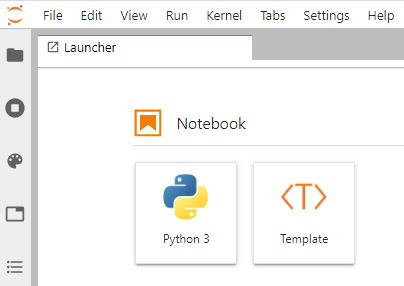

# Using notebook templates in JupyterLab

Before I found Tim Paine's [JupyterLab Template Extension](https://github.com/timkpaine/jupyterlab_templates), I had put together the most often used imports and functions into a python module with which I would populate the first code cell of a new notebook via the %load magic command.

Now, with the JupyterLab Template extension in my current environment (dsml), I have created two templates with a preloaded first cell.
1. JLab_dsml_processing.ipnyb
2. JLab_dsml_reporting.ipnyb: has additional functions for 'prettifying' the HTML/Markdown output.

Note that each environment could have its own template...

Once the extension is successfully installed, the Launcher tab will display a new icon under the Notebook section:

Clicking on the new template button will display the contents of the extension Templates folder for the picking!
Neat!