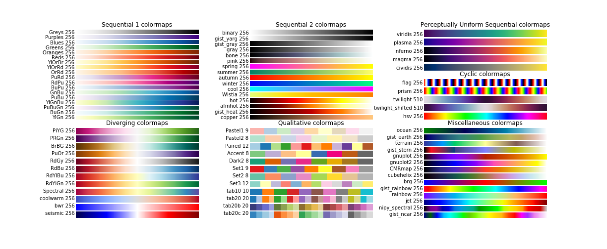

# Recipes Folder
***

This repo will hold often-used tips and workarounds as I find them.

# Here is the very first one:
<div style="text-align:center;background:#c2d3ef;padding:16px;color:#ffffff;font-size:2em;width:98%"><h1>Displaying images with a caption</h1></div>

#### Unless an image already includes a caption, it is in many cases advisable to include one. 
#### Those familiar with HTML5 may know that there is a tag just for that!  

#### It's aptly named `<figure>`. Let's see how it works.

# Add an HTML image link with a caption with the `<figure>` tag wrapping the `` tag:   
The next Markdown cell contains this HTML code:
```html
<figure style="display:inline-block; text-align:center">
  
  <figcaption style="color:teal; font-weight:bold; font-family: Arial, Helvetica, sans-serif;">
       Figure 1 - A long view of Sancerre, France. Source: <a href="https://en.wikipedia.org/wiki/Sancerre">wikipedia</a>
  </figcaption>
</figure>
```

<figure style="display:inline-block; text-align:center">
  
  <figcaption style="color:teal; font-weight:bold; font-family: Arial, Helvetica, sans-serif;">
             Figure 1 - A long view of Sancerre, France. &ensp;Source: <a href="https://en.wikipedia.org/wiki/Sancerre">wikipedia</a>
  </figcaption>
</figure>

***
## Notebooks:
[1_Jupyter and Markdown Tricks.ipnyb](https://nbviewer.jupyter.org/github/CatChenal/Jupyter_Sphere/blob/master/Recipes/1_Jupyter_and_Markdown_Tricks.ipynb)
> Contains functions to insert div blocks with variables along with call examples and a few UTF-8 codes for Geometric Shapes & ANSI escape sequences.

[2_Exclude_large_files_from_Git_repo.ipynb](https://nbviewer.jupyter.org/github/CatChenal/Jupyter_Sphere/blob/master/Recipes/2_Exclude_large_files_from_Git_repo.ipynb)
> Contains my recipe to programmatically update `.git/info/exclude` file to exclude files that exceed GitHub limit.

[3_Displaying_Images_with_Captions.ipynb](https://nbviewer.jupyter.org/github/CatChenal/Jupyter_Sphere/blob/master/Recipes/3_Displaying_Images_with_Captions.ipynb)
> The modular version of the \<figure\> insertion example above.  
    
[4_Plotting_Matplotlib_Colormaps.ipynb](https://nbviewer.jupyter.org/github/CatChenal/Jupyter_Sphere/blob/master/Recipes/4_Plotting_Matplotlib_Colormaps.ipynb)
> Code to obtain this plot:
<figure style="display:flex; flex-flow:column; max-width:1300px; ">
 <figcaption style="color:teal; font-weight:bold; text-align:center; font-family:Arial, Helvetica, sans-serif; ">
             Figure 1 - Matplotlib color maps by category (using gridspec)
 </figcaption>
 
</figure>